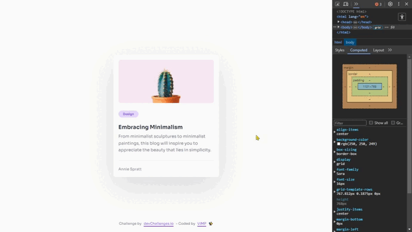
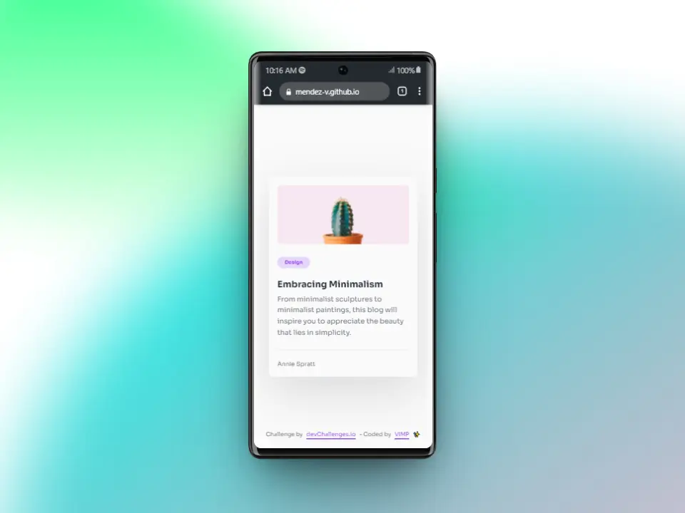
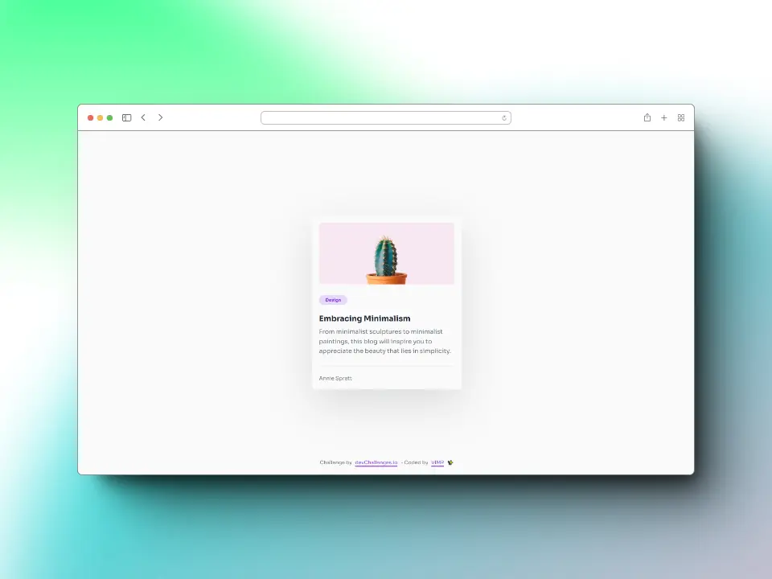

# Minimal blog card

## *The goals:*

🎯 Create a card component that matches the given design.

🎯 Use HTML to create the basic structure.

🎯 Use CSS to style the card.

🎯 Deploy the solution and submit Repository URL and Demo URL.

## *Screenshots*

### 📱 Mobile

### 💻 Desktop

## *Links*

[Live site](https://mendez-v.github.io/minimal-blog-card/) 👀

## *Built with*

📌 HTML semactic

📌 CSS custom properties

📌 CSS Grid

📌 Mobile-first workflow

## *Useful resources*

🌈 Favicon - <a href="https://iconscout.com/3d-illustrations/paint-brush" class="text-underline font-size-sm" target="_blank">Paint Brush</a> by <a href="https://iconscout.com/contributors/sonisokell" class="text-underline font-size-sm" target="_blank">Soni Sokell</a>

## *Author*

✨ devChallenges - [@mendez-v](https://devchallenges.io/my-solutions)

✨ Frontend Mentor - [@mendez-v](https://www.frontendmentor.io/profile/mendez-v)